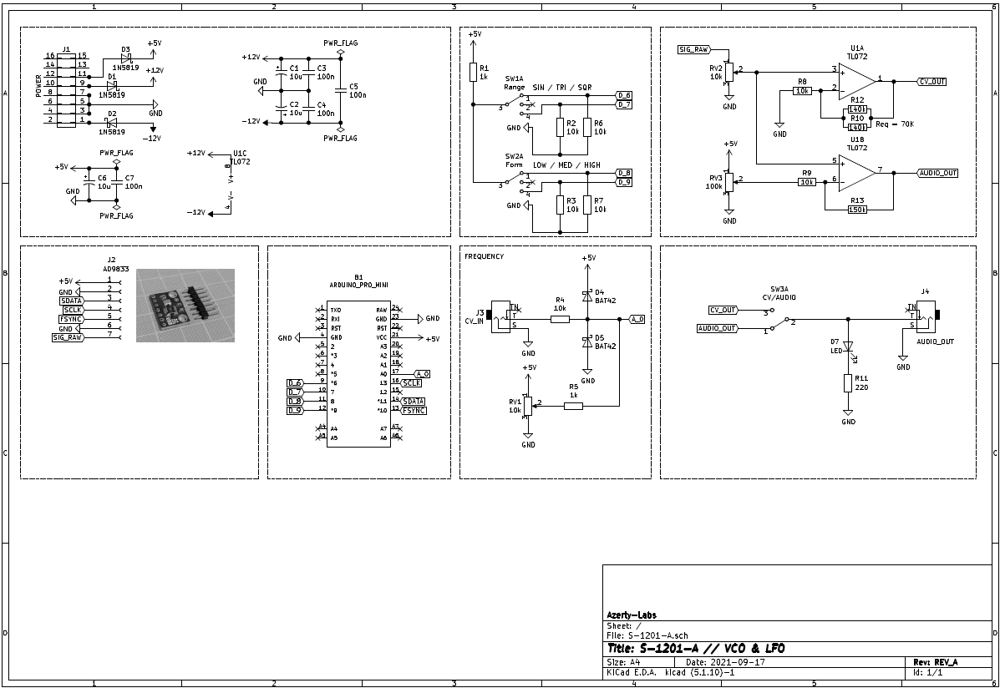
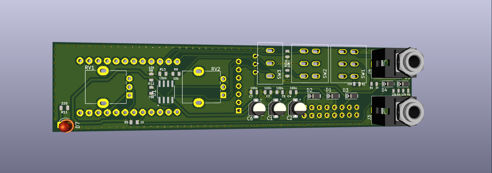
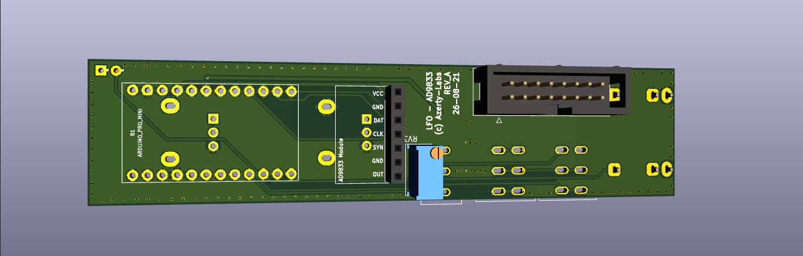

# Eurorack-AD9833-LFVCO
Simple digital voltage controlled oscillator with a wide range of modes based on the **AD9833** chip. Builds and Kits are available on my Etsy page.

#### Description

- **Format **: Eurorack // 3U 6HP 
- **Power consumption:** 5V 50mA
- **Waveform:** Sine wave // Triangle wave // Square wave
- **Frequency:** 0.1Hz to 15kHz (Knob variable + CV + 3 ranges modes)
- **Amplitude:** (AC 10Vpp / DC 5Vpp)

#### Schematics & PCB

#### Assembly i-BOM

- Link to the i-BOM : [File](assets\AD9833-LFVCO.html) 

#### Licence

All Right Reserved to AzertyLabss

